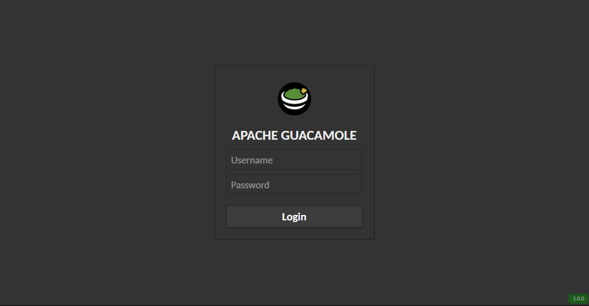

# dark-guacamole
:lipstick: A dark theme for [Apache Guacamole](https://guacamole.apache.org/).

* dark-guacamole on Stylish - [178550/dark-guacamole](https://userstyles.org/styles/178550/dark-guacamole)

## Usage
To use this theme, simply add the CSS code to CSS-injecting browser extensions like [Stylish](https://userstyles.org/), [Stylus](https://add0n.com/stylus.html) etc.
Once the theme is in action, if your Apache Guacamole instance is accessible at `https://guacamole.your.domain.com`, it should look as shown below.

### Here's how it looks like

## Contributing
Found something interesting to add to this theme or rather a :beetle:bug? Let me know about it through the [issue tracker](https://github.com/madmath03/dark-guacamole/issues). [Pull requests](https://github.com/madmath03/dark-guacamole/pulls) are also welcome.

## License 
This theme is released under the [**MIT**](/LICENSE) license.
